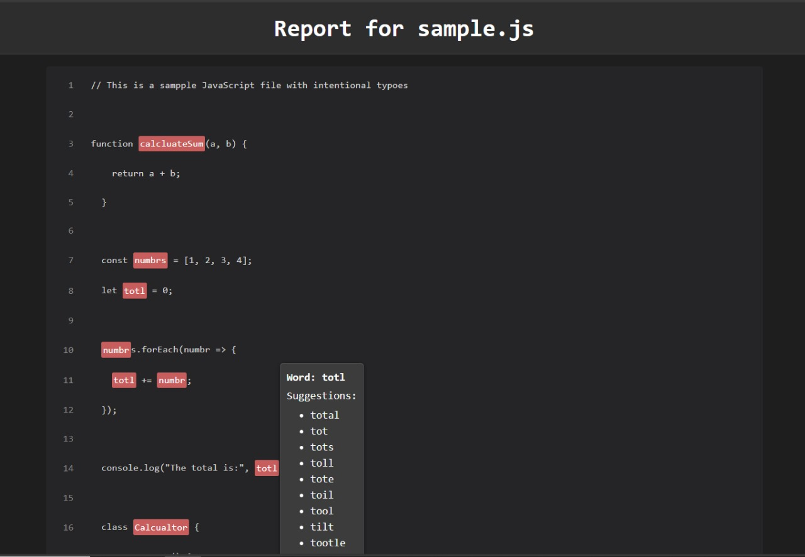

# typo-scanner

A tool to detect and report typographical errors in your JavaScript code. It uses AST parsing along with spell-checking to identify potential typos in variable names, function names, comments, and more.

## Table of Contents

- [Features](#features)
- [Installation](#installation)
- [Usage](#usage)
  - [Command-Line Interface](#command-line-interface)
  - [API Usage](#api-usage)
- [Configuration](#configuration)
- [Example](#example)
- [Testing](#testing)
- [Contributing](#contributing)
- [License](#license)
- [Contact](#contact)

## Features

- **AST-Based Analysis:** Leverages Babel to parse your JavaScript files and extract identifiers.
- **Spell-Checking Integration:** Checks words against a dictionary and suggests corrections.
- **Duplicate Aggregation:** Aggregates duplicate typo occurrences along with occurrence counts.
- **Customizable Whitelist:** Easily configure a list of words (e.g., common JavaScript methods) to ignore.
- **HTML Report Generation:** Generates a dark-themed HTML report with inline code highlights and tooltips.

## Installation

Install the package via npm:

```bash
npm install typo-scanner
```

Or use it with npx:

```bash
npx typo-scanner <file-to-analyze.js>
```

## Usage

### Command-Line Interface

After installation, you can run the tool from the command line. For example:

```bash
typo-scanner sample.js
```

This command will analyze `sample.js` for typos and output the results in the console. If configured, it will also generate an HTML report in your project directory.

### API Usage

You can also import and use `typo-scanner` programmatically in your Node.js projects:

```js
const { analyzeFile } = require('typo-scanner');

const filePath = 'path/to/your/file.js';
const results = analyzeFile(filePath);

console.log(results);
```

## Configuration

You can customize the behavior of `typo-scanner` by providing a configuration file (e.g., `typoscanner.config.json`) in your project root. This file may include:

- **Whitelist:** Array of words that should not be flagged (e.g., `['forEach', 'map', 'filter', ...]`).
- **Custom Dictionaries:** Define additional words that are valid for your project.

Example configuration:

```json
{
  "whitelist": [
    "forEach",
    "map",
    "filter",
    "reduce",
    "setTimeout",
    "clearTimeout",
    "console"
  ],
  "customDictionary": [
    "myCustomFunction",
    "myVariable"
  ]
}
```

## Example

Consider a JavaScript file `sample.js` with the following content:

```js
// This is a sampple JavaScript file with intentional typoes
function calcluateSum(a, b) {
  return a + b;
}

const numbrs = [1, 2, 3, 4];
let totl = 0;

numbrs.forEach(numbr => {
  totl += numbr;
});

console.log("The total is:", totl);
```

Running the command-line tool:

```bash
typo-scanner sample.js
```

### Console-Based Analysis Output

```
Word: calcluateSum
Occurrences: 1
Suggestions: calculates
-> At line 3, column 9
   function calcluateSum(a, b) {
-----
Word: numbrs
Occurrences: 2
Suggestions: numbers, numbs, number's
-> At line 7, column 8
     const numbrs = [1, 2, 3, 4];
-> At line 10, column 2
     numbrs.forEach(numbr => {
-----
Word: totl
Occurrences: 3
Suggestions: total, tot, tots, toll, tote, toil, tool, tilt, tootle, toot
-> At line 8, column 6
     let totl = 0;
-> At line 11, column 4
       totl += numbr;
-> At line 14, column 31
     console.log("The total is:", totl);
-----
HTML report generated at: D:\NPM_Package_build\typo-scanner\src\report.html
```

### HTML Report

If HTML reporting is enabled, an interactive report will be generated in your project directory. Below is a sample screenshot of the generated report:



## Testing

To run tests locally:

```bash
npm test
```

Make sure you have written tests (using Mocha, Jest, or another testing framework) to verify that your analyzer works as expected on a variety of sample inputs.

## Contributing

Contributions are welcome! If you find a bug, have a feature request, or want to submit a pull request, please follow these steps:

1. Fork the repository.
2. Create a new branch for your feature or bugfix.
3. Write tests to cover your changes.
4. Submit a pull request with a clear description of your changes.

Please refer to our [CONTRIBUTING.md](CONTRIBUTING.md) for more details.

## License

This project is licensed under the MIT License. See the [LICENSE](LICENSE) file for details.

## Contact

For questions, suggestions, or feedback, please open an issue on GitHub or contact [yashpatil0107@gmail.com](mailto:yashpatil0107@gmail.com).

---

